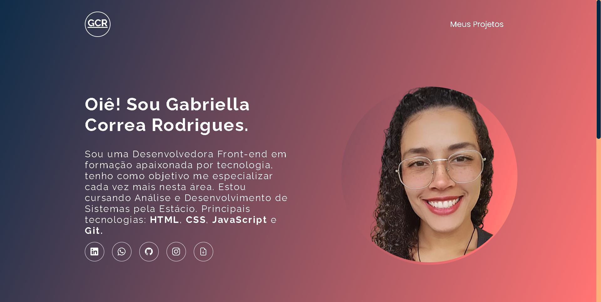

<h1 align="center">Portfólio - Dev em Dobro</h1>

  <a href="#-tecnologias">Tecnologias</a>&nbsp;&nbsp;&nbsp;|&nbsp;&nbsp;&nbsp;
  <a href="#-projeto">Projeto</a>&nbsp;&nbsp;&nbsp;|&nbsp;&nbsp;&nbsp;
  <a href="#-funcionalidades">Funcionalidades</a>&nbsp;&nbsp;&nbsp;&nbsp;&nbsp;&nbsp;

 

  

## 🚀 Tecnologias

Esse projeto foi desenvolvido com as seguintes tecnologias:

- HTML5
- CSS3
- JavaScript
- Git e Github

### 💻 Projeto.

Projeto construído durante o evento do Dev em Dobro.
- [Acesse o projeto finalizado, online](https://devgaab.github.io/proj-portfolio-dev-em-dobro/)

### ⚙ Funcionalidades

- Projeto responsivo
- Barra de navegação simples
- Scrollbar personalisado

---